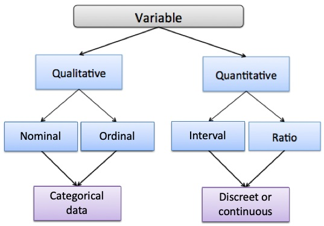
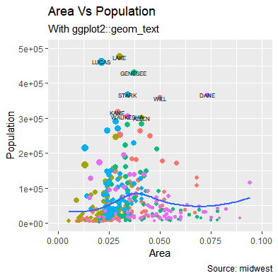
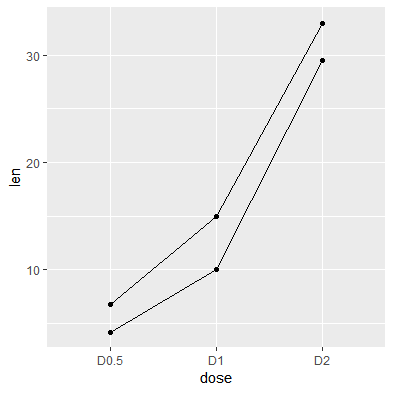
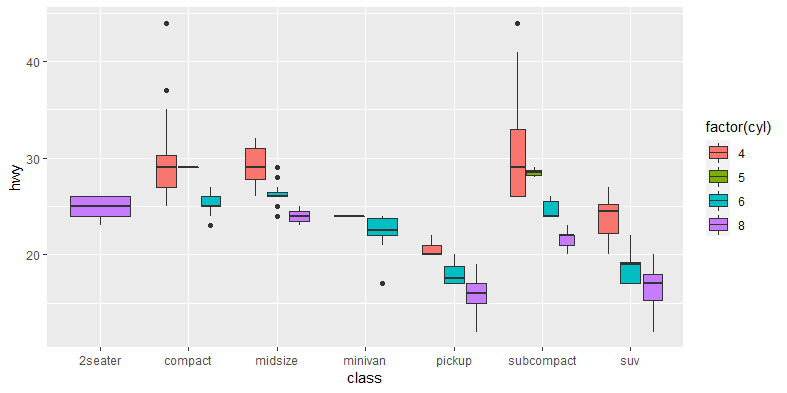

```{r setup, include=FALSE}
options(htmltools.dir.version = FALSE)
knitr::opts_chunk$set(echo = TRUE, 
                      message = FALSE,	
                      warning = FALSE,
                      eval = TRUE,
                      tidy = FALSE)
library(knitr)

```

class: inverse, center

<div style="text-align: left">

</div>


## Data Visualization Training (ggplot2)

#### UI LISA<br> Materials: https://fomotis.github.io/ggplot_training/

<div style="text-align: right">

</div>


---
class: center, middle

# Week one

`Assumptions` <br>

`Grammar of graphics` <br>

`Enters ggplot2` <br>

`Why the fuss about ggplot2?` <br>

<br>
<br>

.pull-right[
`Olusoji & Olubusoye`
]

---

# Assumptions

1. You have access to internet `r emo::ji("heavy_check_mark")`

2. You have some experience working with `R` `r emo::ji("question")`

3. You like cool graphics `r emo::ji("smile")`


## Desirable but not necessary

1. You have some experience with `tidyverse` and `piping(%>%)` `r emo::ji("+1")`


#### `r emo::ji("cross mark")` assumption 2  `r emo::ji("right arrow")` crash course in `R` and `tidyverse`

#### `r emo::ji("heavy_check_mark")` assumption 2  `r emo::ji("right arrow")` Grammar of graphics

---

# Crash course in `tidyverse`

.pull-left[


* free open source statistical software `r emo::ji("thumbsup")`
* integrate easily with other languages (`Python`, `C++`) `r emo::ji("thumbsup")`
* fantastic community `r emo::ji("thumbsup")`
* awesome ecosystem of packages `r emo::ji("thumbsup")`
]


.pull-right[


* an opinionated collection of packages designed for data science
* `broom`, `dplyr`, `forcats`, `ggplot2`, `purrr`, `readr`, `stringr`, `tibble`, `tidyr`
8 `broom` provides tools for tidymodels
* `dplyr` provides a set of functions for common data manipulation problems.
* `tidyr` provides a set of functions to go from messy data to tidy data.
* `purrr` provides tools for functional programming. *"You don't always have to write those loops"*

[www.tidyverse.org](https://www.tidyverse.org/packages/)
] [TidyVerse_Part1_V1.html](TidyVerse_Part1_V1.html)

---

# Pipe

* ceci n'est pas un pipe `%>%` 

* It allows you to chain several `R` commands together `r emo::ji("smile")`

* The idea is to  have `R` codes as `x %>% f` rather than `f(x)`. This is an old concept in Linux and Unix systems.

* There are other pipe operators (`%T>%`, `%$%`, `%<>%`) in `magrittr`

* Read more about piping [here](https://cran.r-project.org/web/packages/magrittr/vignettes/magrittr.html)


`Let's see tidyverse in action`

---

# `selecting`

```{r chk1}
library(tidyverse)
naija_covid <- read_delim("Data/nigeria_covid-19_subnational.csv", delim = ";")
naija_covid %>% select(c(1, 5, 7:9)) -> naija_covid
DT::datatable(head(naija_covid), class = 'cell-border stripe', rownames = FALSE)
```

* variants: `select_if()`, `select_at()`, `select_var()`.

---

# `renaming`

```{r chk2}
naija_covid %>% rename(Date = DATE, States = REGION, Cases = `Contaminés`, Deaths = `Décès`, Recovered = `Guéris`) -> naija_covid
DT::datatable(head(naija_covid), class = 'cell-border stripe', rownames = FALSE)
```

* variants: `rename_if()`, `rename_at()`, `rename_all()`

---

# `mutate`

```{r chk3}
naija_covid <- naija_covid %>% mutate_at(c("Cases", "Deaths", "Recovered"), as.numeric)
DT::datatable(head(naija_covid), class = 'cell-border stripe', rownames = FALSE)
```

* variants: `mutate_if()`, `mutate_at()`, `mutate_all()`

---

# `groups and summaries`

```{r chk4}
total_cases <- naija_covid %>% group_by(States) %>% summarise(Total_Cases = sum(Cases, na.rm = TRUE)) %>% 
  arrange(desc(Total_Cases))
DT::datatable(total_cases, class = 'cell-border stripe', rownames = FALSE, 
              options = list(pageLength = 4))
```

* `summairse_at()`, `summarise_if()`, `summarise_all()`, `summarise_each()`

---

# `filtering`

```{r chk5}
library(readxl)
participants_data <- read_xlsx("Data/Data_Visualization_ggplot2_Responses.xlsx") %>% select(-Name)
participants_data %>% filter(Gender == "Female") -> female_participants
female_participants %>% 
  select(email = `Email Address`, Gender, R_familiarity = `Are you familiar with R software?`) %>%
  DT::datatable(class = 'cell-border stripe', rownames = FALSE, 
                options = list(pageLength = 4))
```

---

# `pivot_wider`

```{r chk6}
participants_data %>% mutate(Nationality = tolower(Nationality)) %>%
  group_by(Gender, Nationality) %>% summarise(Number = n()) -> long_version
long_version %>% 
  pivot_wider(id_cols = c('Nationality'), names_from = "Gender", 
              values_from = "Number") -> wide_version

  DT::datatable(wide_version, class = 'cell-border stripe', 
                rownames = FALSE, options = list(pageLength = 4))
```

---

# `pivot_longer`

```{r chk7}
pivot_longer(wide_version, cols = -Nationality, 
             names_to = "Gender", values_to = "Number") -> long_version2
DT::datatable(long_version2, class = 'cell-border stripe', 
                rownames = FALSE, options = list(pageLength = 4))
```


Nice animation on these in [tidyexplain](https://github.com/gadenbuie/tidyexplain)

---

# Notes

* The slides above do not describe a tip of the iceberg when it comes to tidyverse
* Should you run into any problem, just Google the error message you get from `R`
* Twitter is also a fun place to learn these days
* Follow [#tidytuesday](https://twitter.com/search?q=%23TidyTuesday&src=typeahead_click) and [@tidyversetweets](https://twitter.com/tidyversetweets) for some cool visualizations and tidyverse tricks
* Check [https://www.tidyverse.org/learn/](https://www.tidyverse.org/learn/) for free resources on tidyverse

---

# `Some DIY`

1. Using the participants data, extract another dataset containing all `student` participants.

2. Repeat the same action in 1 for `academic researchers`

3. What is the `gender frequency` for the participants?

4. What `other training` is of interest to the participants? Rank this table in `descending` order.


---

# Grammar of graphics

.pull-left[

]

.pull-right[

* Term coined by `Leland Wilkinson` expanded to layered grammar of graphics by `Hadley Wickham`.

* *"A grammar of graphics is a tool that enables us to concisely describe the components of a graphic. Such a grammar allows us to move beyond named graphics and gain insight into the deep structure that underlies statistical graphics"*.

* The concept is essentially a set of rules that allows us to think of a statistical graphic beyond a certain name and format. 
]

---

# Grammar of graphics 2

.pull-left[


* **With this tool, you don't have to think about a scatter or box plot, but what set of information should I put on this graph to convey the message I want**
]

.pull-right[
* A plot is any name you give it. While the elements of the plots are merely verbs

* Thus you build plots as you would build a sentence

* Think of yourself as an artist with a canvas and you are free to be as imaginative as possible with your painting `r emo::ji("smiling face with sunglasses")`

* `Hence, you can have a boxplot with scatter points on it if you so desire. Actually, that exists` `r emo::ji("smile")`

.footnote[http://dx.doi.org/10.1198/jcgs.2009.07098]
]

---

# Enters `ggplot2`

* ggplot2 is the `R` package that allows you implement (layered) grammar of graphics

* This package is a product of `Hadley Wickham's` PhD.

## Why the Fuss about ggplot2

* `ggplot2` is one of the most downloaded `R` package. Let's check how many [downloads](https://gallery.shinyapps.io/cran-explorer/?_ga=2.106534406.467526461.1596478926-765883120.1595676024)

* ggplot2 follows a clear and consistent syntax `ggplot(aes()) + geom_*()`. We will see more of this next week.

* Nice set of [extensions](https://exts.ggplot2.tidyverse.org/gallery/)

* Vast amount of [resources](https://evamaerey.github.io/ggplot2_grammar_guide/about)

 ** Before next Tuesday, kindly download this [cheatsheet](https://github.com/rstudio/cheatsheets/blob/master/data-visualization-2.1.pdf) and study this [resources](https://evamaerey.github.io/ggplot2_grammar_guide/about) *

---
class: center, middle

# Week two

`Basic ggplot2 functions (ggplot and qplot)` <br>

`Basic plots with ggplot2` <br>

<br>
<br>

.pull-right[
`Olusoji & Olubusoye`
]

---

# Basic ggplot2 functions

* `qplot` is sort of the easy way out so we will leave that till the end of this week's lesson. 

* Let us dive into ggplot2 as an artist rather than someone looking for a quick fix.

* As earlier mentioned, ggplot2 follows a consistent and easy syntax. **ggplot() + geom_* + ...  **

* The `ggplot()` command creates a basic canvas for you, on which you then add whatever you want to this canvas with a `+`

* Hence, the word `ggplot()` is the basic function with which you start a chart.

* Type the code below in your R session

```{r chk8, eval = FALSE}
?ggplot
```

* **data** is the dataset you would like to plot and **mapping** is the aesthetics.

---

# Aesthetics

* Think of aesthetics, `aes()`, as the part of your dataset you want to map to things on your plot.

* ggplot expects that everything in an `aes()` statement to be a variable.

* Since `aes()` is a function itself, it has arguments.

```{r chk9, eval = FALSE}
?aes
```

* **x** and **y** are arguments for the variables you would like on x and y axis respectively.

* other arguments you can pass include; `fill`, `linetype`, `size`, `color`, `group`, etc.

---

# `geom_*`

* After setting up the canvas, you can start drawing. 

* You do this by adding geoms.

* There are quite a number of geoms. Hence, the cheatsheet.

* Popular ones includes; `geom_line()`, `geom_point()`, `geom_area()`, `geom_tile()`, `geom_errorbar()`, `geom_boxplot()`, `geom_bar`, `geom_bar`, etc.

* Let's see them all in action.

---

# Basic plots with ggplot2 (The basic canvas)

.pull-left[
```{r chk10a, eval =FALSE}
participants_data %>% filter(Gender == "Female") %>%
  ggplot(aes(x = `Are you familiar with R software?`)) 
```
]

.pull-right[
```{r chk10b, echo=FALSE}
participants_data %>% filter(Gender == "Female") %>%
  ggplot(aes(x = `Are you familiar with R software?`))
```
]

* As earlier mentioned, the `ggplot()` command just gives you a basic canvas which you can then draw on.

---

# Basic plots with ggplot2 (`geom_bar`)

.pull-left[
```{r chk11a, eval =FALSE}
participants_data %>% filter(Gender == "Female") %>%
  ggplot(aes(x = `Are you familiar with R software?`)) + 
  geom_bar(stat = 'count')

```
]

.pull-right[
```{r chk11b, echo=FALSE}
participants_data %>% filter(Gender == "Female") %>%
  ggplot(aes(x = `Are you familiar with R software?`)) + 
  geom_bar(stat = 'count')

```
]

* Looks like those SPSS plots, right? `r emo::ji("smile")`

* We will do more customization next week. For now, enjoy this rather not so pretty plots. `r emo::ji("smile")`

---

# Some more preprocessing on the COVID-19 data

```{r chk12}
naija_covid %>% mutate(Date = as.Date(Date, format = "%d/%m/%Y")) %>% 
  mutate(
    dt = c(0, diff(Date)), 
    Day = cumsum(c(1, diff(Date)))
  ) -> naija_covid    


DT::datatable(naija_covid, class = 'cell-border stripe', 
              rownames = FALSE, options = list(pageLength = 3))
```

---

# Basic plots with ggplot2 (`geom_line`, `geom_point`)

.pull-left[
```{r chk13a, eval = FALSE}
naija_covid %>% filter(States == 'Lagos') %>% 
  ggplot(aes(x = Day, y = Cases, group = 1)) + 
  geom_line() +
  geom_point() 
```
]

.pull-right[
```{r chk13b, echo=FALSE}
  naija_covid %>% filter(States == 'Lagos') %>% 
  ggplot(aes(x = Day, y = Cases, group = 1)) + 
  geom_line() +
  geom_point() 
```
]

---

# Basic plots with ggplot2 (`geom_line()`)

.pull-left[
```{r chk14a, eval = FALSE}
naija_covid %>% filter(States %in% c('Lagos', 'Oyo', 'Ogun')) %>% 
  ggplot(aes(x = Day, y = Cases, group = States, 
             color = States)) + 
  geom_line()
```

* Note the use of the `group` and `color` aesthetics
]

.pull-right[
```{r chk14b, echo = FALSE}
naija_covid %>% filter(States %in% c('Lagos', 'Oyo', 'Ogun')) %>% 
  ggplot(aes(x = Day, y = Cases, group = States, 
             color = States)) + 
  geom_line()
```
]

---

# Basic plots with ggplot2 (`geom_boxplot`)

.pull-left[
```{r chk15a, eval = FALSE}
data("sleep")
sleep %>% ggplot(aes(x = group, 
                     y = extra)) +
  geom_boxplot(fill = "orange")
```
]

.pull-right[
```{r chk15b, echo=FALSE}
data("sleep")
sleep %>% ggplot(aes(x = group, y = extra)) +
  geom_boxplot(fill = "orange")
```

]

---
# Basic plots with ggplot2 (`geom_errorbar`)

.pull-left[
```{r chk16a, eval = FALSE}
sleep %>% group_by(group) %>%
  summarise(ave = mean(extra), 
            vs = sd(extra)) %>%
  ggplot(aes(x = group, y = ave, group = 1)) +
  geom_errorbar(aes(ymin = ave-vs, ymax=ave+vs), width = 0.1, 
                size = 1.3) + 
  geom_point(size = 7, color = 'orange3')
```
]

.pull-right[
```{r chk16b, echo = FALSE}
sleep %>% group_by(group) %>%
  summarise(ave = mean(extra), 
            vs = sd(extra)) %>%
  ggplot(aes(x = group, y = ave, group = 1)) +
  geom_errorbar(aes(ymin = ave-vs, ymax=ave+vs), width = 0.1, 
                size = 1.3) + 
  geom_point(size = 7, color = 'orange3')
```
]

---
# Basic plots with ggplot2 (`geom_density`)

.pull-left[
```{r chk17a, eval = FALSE}
data("sleep")
sleep %>% ggplot(aes(x = extra)) +
  geom_density(aes(fill = group))
```
* You can also put aesthetic and data arguments in `geom_*`
]

.pull-right[
```{r chk17b, echo = FALSE}
data("sleep")
sleep %>% ggplot(aes(x = extra)) +
  geom_density(aes(fill = group))
```
]

* This opens up endless possibilities. For example, you can plot two different datasets together `r emo::ji("smile")`.

---

# Round up

* As you might have noticed, we tried to keep it simple, basic and clean.

* It is important for participants to properly understand these basics for what is to come next.

* Try to go through the cheasheet and resource provided last week and practice some more.

## `DIY`

Make a side by side barplot of the participants familiarity with `R`. Let the gender be on the x axis, the count on the y axis.

---
class: center, middle

# Week three

`Legends and Themes customization` <br>

<br>
<br>

.pull-right[
`Olusoji & Olubusoye`
]

---

# Legends
* Legends and themes aren't really about the plot, they are about art and communication.
.pull-left[
```{r chk18a, eval = FALSE}
naija_covid %>% filter(States %in% c('Lagos', 'Oyo', 'Ogun')) %>% 
  ggplot(aes(x = Day, y = Cases, group = States, 
             color = States)) + 
  geom_line()
```
]

.pull-right[
```{r chk18b, echo = FALSE}
naija_covid %>% filter(States %in% c('Lagos', 'Oyo', 'Ogun')) %>% 
  ggplot(aes(x = Day, y = Cases, group = States, 
             color = States)) + 
  geom_line()
```
]

---

# Customizing Legend title

.pull-left[
* To be able to customize a legend, you must know the aesthetics being summarised in the legend.

* For the plot above, the `color` aesthetics is what is summarised in the legend.

* The same can be done for any other aesthetics.
```{r chk19a, eval = FALSE}
naija_covid %>% filter(States %in% c('Lagos', 'Oyo', 'Ogun')) %>% 
  ggplot(aes(x = Day, y = Cases, group = States, 
             color = States)) + 
  geom_line() + 
*  labs(color = 'Three States') 
```
]

.pull-right[
```{r chk19b, echo = FALSE}
naija_covid %>% filter(States %in% c('Lagos', 'Oyo', 'Ogun')) %>% 
  ggplot(aes(x = Day, y = Cases, group = States, 
             color = States)) + 
  geom_line() + 
  labs(color = 'Three States') 
```
]


---

# Customizing Legend Position

.pull-left[

* The `legend.position` option in the `theme()` function allows you to place legend in the position of your choice.

* You should type `?theme` in your `R` session. More about this in theme customization 
```{r chk20a, eval = FALSE}
naija_covid %>% filter(States %in% c('Lagos', 'Oyo', 'Ogun')) %>% 
  ggplot(aes(x = Day, y = Cases, group = States, 
             color = States)) + 
  geom_line() + 
  labs(color = 'Three States') + 
*  theme(legend.position = 'top')
```
]

.pull-right[
```{r chk20b, echo = FALSE}
naija_covid %>% filter(States %in% c('Lagos', 'Oyo', 'Ogun')) %>% 
  ggplot(aes(x = Day, y = Cases, group = States, 
             color = States)) + 
  geom_line() + 
  labs(color = 'Three States') + 
  theme(legend.position = 'top')
```
]


---

# Customizing Legend size

.pull-left[
* The `legend.title` and `legend.text` options allows for customization of texts and titles in the legend.

* Note that we used the function `element_text()`. Others include; `element_rect()`, `element_blank()`, `element_line()`

```{r chk21a, eval = FALSE}
naija_covid %>% filter(States %in% c('Lagos', 'Oyo', 'Ogun')) %>% 
  ggplot(aes(x = Day, y = Cases, group = States, 
             color = States)) + 
*  geom_line(size = 2) + 
  labs(color = 'Three States') + 
*  theme(legend.position = 'top', 
*         legend.title = element_text(face = 'bold', size = 18), 
*         legend.text = element_text(face = 'bold', size = 15))
```
]

.pull-right[
```{r chk21b, echo = FALSE}
naija_covid %>% filter(States %in% c('Lagos', 'Oyo', 'Ogun')) %>% 
  ggplot(aes(x = Day, y = Cases, group = States, 
             color = States)) + 
  geom_line(size = 2) + 
  labs(color = 'Three States') + 
  theme(legend.position = 'top', 
         legend.title = element_text(face = 'bold', size = 18), 
         legend.text = element_text(face = 'bold', size = 15))
```
]

---

# Themes

* You can customize and write your own themes. However, there are some themes already existing in `ggplot2`.

* Inbuilt themes include; `theme_bw()`, `theme_classic()`, `theme_minimal()`, `theme_dark()`, etc.

* There are packages built around theme customization, e.g. `ggpubr` which provides you with `theme_pubr()`

* Let's apply some of these available themes.

---

# Available Themes

.pull-left[

* Note that we place `theme_minimal()` before `theme()`. 

* We do this to override the default options for `legend.title` and `legend.text` in `theme_minimal()` which implies that we are already customizing `theme_minimal()`.
```{r chk22a, eval = FALSE}
naija_covid %>% filter(States %in% c('Lagos', 'Oyo', 'Ogun')) %>% 
  ggplot(aes(x = Day, y = Cases, group = States, 
             color = States)) + 
  geom_line(size = 2) + 
*  theme_minimal() +
  labs(color = 'Three States') + 
  theme(legend.position = 'top', 
         legend.title = element_text(face = 'bold', size = 18), 
         legend.text = element_text(face = 'bold', size = 15))
```
]

.pull-right[
```{r chk22b, echo = FALSE}
naija_covid %>% filter(States %in% c('Lagos', 'Oyo', 'Ogun')) %>% 
  ggplot(aes(x = Day, y = Cases, group = States, 
             color = States)) + 
  geom_line(size = 2) + 
  theme_minimal() +
  labs(color = 'Three States') + 
  theme(legend.position = 'top', 
         legend.title = element_text(face = 'bold', size = 18), 
         legend.text = element_text(face = 'bold', size = 15))
```
]

---

# Customising Themes 1.

.pull-left[
* `axis.line.x` and `axis.line.y` are variants of the `axis.line` argument.

```{r chk23a, eval = FALSE}
naija_covid %>% filter(States %in% c('Lagos', 'Oyo', 'Ogun')) %>% 
  ggplot(aes(x = Day, y = Cases, group = States, 
             color = States)) + 
  geom_line(size = 2) + 
  theme_minimal() +
  labs(color = 'Three States') + 
  theme(legend.position = 'top', 
         legend.title = element_text(face = 'bold', size = 18), 
         legend.text = element_text(face = 'bold', size = 15), 
*         axis.line = element_line(size = 3, colour = 'green3', 
*                                linetype = 'dashed'))
```
]

.pull-right[
```{r chk23b, echo = FALSE}
naija_covid %>% filter(States %in% c('Lagos', 'Oyo', 'Ogun')) %>% 
  ggplot(aes(x = Day, y = Cases, group = States, 
             color = States)) + 
  geom_line(size = 2) + 
  theme_minimal() +
  labs(color = 'Three States') + 
  theme(legend.position = 'top', 
         legend.title = element_text(face = 'bold', size = 18), 
         legend.text = element_text(face = 'bold', size = 15), 
        axis.line = element_line(size = 3, colour = 'green3', 
                                 linetype = 'dashed'))
```
]

---

# Customising Themes 2.

.pull-left[
```{r chk24a, eval = FALSE}
naija_covid %>% filter(States %in% c('Lagos', 'Oyo', 'Ogun')) %>% 
  ggplot(aes(x = Day, y = Cases, group = States, 
             color = States)) + 
  geom_line(size = 2) + 
  theme_minimal() +
  labs(color = 'Three States', x = 'Day', y = 'COVID-19 Cases') + 
  theme(legend.position = 'top', 
         legend.title = element_text(face = 'bold', size = 18), 
         legend.text = element_text(face = 'bold', size = 15), 
         axis.line = element_line(size = 9, colour = 'green3', 
                                linetype = 'dashed'), 
*        axis.text = element_text(face = 'bold', size = 22, 
*                                 family = 'sans'))
```
]

.pull-right[
```{r chk24b, echo = FALSE}
naija_covid %>% filter(States %in% c('Lagos', 'Oyo', 'Ogun')) %>% 
  ggplot(aes(x = Day, y = Cases, group = States, 
             color = States)) + 
  geom_line(size = 2) + 
  theme_minimal() +
  labs(color = 'Three States', x = 'Day', y = 'COVID-19 Cases') + 
  theme(legend.position = 'top', 
         legend.title = element_text(face = 'bold', size = 18), 
         legend.text = element_text(face = 'bold', size = 15), 
         axis.line = element_line(size = 3, colour = 'green3', 
                                linetype = 'dashed'), 
        axis.text = element_text(face = 'bold', size = 22, 
                                 family = 'sans'))
```
]


---

# Customising Themes 3.

.pull-left[
```{r chk25a, eval = FALSE}
naija_covid %>% filter(States %in% c('Lagos', 'Oyo', 'Ogun')) %>% 
  ggplot(aes(x = Day, y = Cases, group = States, 
             color = States)) + 
  geom_line(size = 2) + 
  theme_minimal() +
  labs(color = 'Three States', x = 'Day', y = 'COVID-19 Cases') + 
  theme(legend.position = 'top', 
         legend.title = element_text(face = 'bold', size = 18), 
         legend.text = element_text(face = 'bold', size = 15), 
         axis.line = element_line(size = 9, colour = 'green3', 
                                linetype = 'dashed'), 
*        axis.text = element_text(face = 'bold', size = 22, 
*                                 family = 'sans'), 
         axis.title = element_text(face = 'bold', size = 25, 
*                                 family = 'sans')
)
```
]

.pull-right[
```{r chk25b, echo = FALSE}
naija_covid %>% filter(States %in% c('Lagos', 'Oyo', 'Ogun')) %>% 
  ggplot(aes(x = Day, y = Cases, group = States, 
             color = States)) + 
  geom_line(size = 2) + 
  theme_minimal() +
  labs(color = 'Three States', x = 'Day', y = 'COVID-19 Cases') + 
  theme(legend.position = 'top', 
         legend.title = element_text(face = 'bold', size = 18), 
         legend.text = element_text(face = 'bold', size = 15), 
         axis.line = element_line(size = 9, colour = 'green3', 
                                linetype = 'dashed'), 
        axis.text = element_text(face = 'bold', size = 22, 
                                 family = 'sans'), 
         axis.title = element_text(face = 'bold', size = 25, 
                                   family = 'sans')
)
```
]

---

# Round up

* `labs()` allows you to set x and y axis titles as well as make changes to other parts of your plot.

* `theme()` allows you to customise a bunch of things about your graphs.

* You can always start from an existing theme and customize it to your satisfaction

* You can as well write your own theme from the scratch.

* Endeavour to read more using `?theme`, `?labs`.

## DIY

* Customize the other plots discussed in the last class.


---
class: center, middle

# Week four

---

# Week four topic one
```{r chk26a, eval=FALSE}
install.packages("maps")
```


```{r chk26b}
library(ggplot2)
library(dplyr)
library(maps)
library(viridis)
theme_set(
  theme_void()
  )
```

---

# Create a simple world map

```{r chk27}
world_map <- map_data("world")
ggplot(world_map, aes(x = long, y = lat, group = group)) +
  geom_polygon(fill="lightgray", colour = "white")
```
---

# Maps for specific regions
```{r chk28}
some.eu.countries <- c(
  "Portugal", "Spain", "France", "Switzerland", "Germany",
  "Austria", "Belgium", "UK", "Netherlands",
  "Denmark", "Poland", "Italy", 
  "Croatia", "Slovenia", "Hungary", "Slovakia",
  "Czech republic"
)
some.eu.maps <- map_data("world", region = some.eu.countries)

# Compute the centroid as the mean longitude and lattitude
# Used as label coordinate for country's names
region.lab.data <- some.eu.maps %>%
  group_by(region) %>%
  summarise(long = mean(long), lat = mean(lat))
```

---
# Visualize
```{r chk29}
ggplot(some.eu.maps, aes(x = long, y = lat)) +
  geom_polygon(aes( group = group, fill = region))+
  geom_text(aes(label = region), data = region.lab.data,  size = 3, hjust = 0.5)+ scale_fill_viridis_d() + theme_void() + 
  theme(legend.position = "none")
```

---
class: center, middle

# Week five

---

# Week five : Plotting with ggplot2

# Learning objective

`r emo::ji("heavy_check_mark")` General introduction; data & types of plot.

`r emo::ji("heavy_check_mark")` Producing scatter plots with ggplot2 <br>

`r emo::ji("heavy_check_mark")` Producing boxplots with ggplot2 <br>

`r emo::ji("heavy_check_mark")` Producing time series plots with ggplot2 <br>

`r emo::ji("heavy_check_mark")` Universal plot setting with ggplot2 <br>

`r emo::ji("heavy_check_mark")` Introduction to Faceting 


.pull-right[ `Olubusoye & Akintande`]

---

# Week five topic one

# Producing plot
.pull-left[
* The main questions are: 
 * What are plots?
 * What are the different types of plots we can use?
 * Can you tell a story by mere looking at these plots?
 * How would you explain them?]

.pull-right[]
---
# Producing plot Cont'd

# Lecture expectation

.pull-left[]

.pull-right[

* you will learn about various type of data class.
* you will understand how data classes inform the appropriate type of graph.
* you will learn about various visualization types.
* different kinds of plots, when to use them and when not to.
]


---
# Producing plot Cont'd: Data classification

.pull-left[]

.pull-right[

* `Qualitative` emerges from quality. A type of data that are describe mainly on attributes.
* `Nominal` are qualitative mainly for identification or assignment. E.g. [Gender, staff ID]

* `Ordinal` are qualitative too but with preference for position or rank. Unlike nominal, there is hierarchy.

* `Quantitative` emerges from quantity or measureable observation.

* `Discrete` are metric that cannot take decimal point.

* `Continuous` are metric that are both decimal and non-decimal.

]

---
# Data classification: How Data inform graphs

.pull-left[]

.pull-right[

* `Comparing two or more groups` [Gender distribution, Colour distribution, Age group distribution, etc.]
* `Comparing frequency` [Opinion poll, Election results, etc.]

* `Looking for pattern/trend - Frequency based` [Between two or more groups]

* `Looking for pattern/trend - time based` [single or between two or more variables]

* `Assessing uniqueness` [Outliers]

]

---

# Type of visualization

.pull-left[

* `Temporal Visualization` [one-dimensional data, showing some sort of linear relationship - Scatter-plots, Gantt charts, Timelines, Time-Series, Line plots]
]

.pull-right[

* `Network Visualization` [where each variable is connected. e.g, Node-link diagrams, Matrix plots, Alluvial & Dependency plots.]

* `Hierarchical Visualization` [when the data can be clustered under different categories. e.g., Tree diagrams, Dendrograms, Sunburst diagrams, Ring charts]

* `Multi-dimensional Visualization` [used when there multiple dimensions- e.g. 2D/3D Histograms, 2D/3D Scatter, Pie, Bar, Line plots]

]

---

# Types of Plot: Barplot
.pull-left[
* `Bar plots` [the most basic way to present data, but it can be useful in achieving results through simplicity and clarity.]
```{r chk30a, eval=FALSE}
day = c(4,8,12,5,2)
names(day) = c('Mon', 'Tue', 'Wed','Thur', 'Fri')
barplot(day, ylab = 'Frequency', xlab = 'Week day', col = c(1,2,3,4,5), legend=T)
```
]
.pull-right[

]
---
# Types of Plot Cont'd: Barplot
```{r chk30b, eval=FALSE}
Attendance = c(20,20,25,20,28)
names(Attendance) = c('Lect1', 'Lect2', 'Lect3','Lect4', 'Lect5')
Exam_score = c(30,35,38,35,32)
Test_score = c(20,28,32,31,28)

D = cbind(Exam_score,Test_score,Attendance)

barplot(D, ylab = 'Frequency', xlab = 'Student Items', col = c(1,2,3,4,5),legend=T)
```


---

# Types of Plot Cont'd: Barplot

.pull-left[
* `When to use ` <br>

`r emo::ji("heavy_check_mark")` Comparing a few variables in the same category or datasets with similar variables.

`r emo::ji("heavy_check_mark")` Tracking the progression of a few (1 or 2) variables over time.

* `When not to use` <br>

`r emo::ji("heavy_check_mark")` More than 3 categories of variables
`r emo::ji("heavy_check_mark")` Visualizing continuous data.
]

.pull-right[

]

---
# Types of Plot Cont'd: Line plots

.pull-left[
* When comparing stock prices, or analyzing views of a video over time, line plots can be found pretty much everywhere. 

* The main benefit is that they are very intuitive and the reader can instantly grasp on to the results. 

* `When to use:` <br>
`r emo::ji("heavy_check_mark")` Tracking and comparing several variables across time.<br>
`r emo::ji("heavy_check_mark")` Analyzing trends and variation <br>
`r emo::ji("heavy_check_mark")` Predicting future values.

* `When not to use:` <br>
`r emo::ji("heavy_check_mark")` Getting a general overview of your data.<br>
`r emo::ji("heavy_check_mark")` Analyzing individual components or sections.

]

.pull-right[

]

---
# Types of Plot Cont'd: Scatter plots

.pull-left[

* Used to describe relationships, look at individual sections of data, and describe the distribution of data.


* `When to use:` <br>
`r emo::ji("heavy_check_mark")` Analyzing individual points <br>
`r emo::ji("heavy_check_mark")` Outlier analysis and understanding fluctuations <br>
`r emo::ji("heavy_check_mark")` Getting a general overview of variables.

* `When not to use:` <br>
`r emo::ji("heavy_check_mark")` Looking for precision. <br>
`r emo::ji("heavy_check_mark")` One-dimensional data. <br>
`r emo::ji("heavy_check_mark")` Non-numeric/categorical data.
]

.pull-right[

]

---
# Types of Plot Cont'd: Pie chart

.pull-left[

* Used to compare groups, look at individual sections of groups in the data point, and describe the distribution of data.


* `When to use:` <br>
`r emo::ji("heavy_check_mark")` Comparing parts of a whole or relative values.

* `When not to use:` <br>
`r emo::ji("heavy_check_mark")` Comparing data that doesn’t add up to form a whole.
]

.pull-right[

]

---
# Types of Plot Cont'd: Histogram

.pull-left[

* Used to plot a single variable in order to describe the distribution of variable data or frequency.

 * It is possible to super-imposed two histogram in a single chart.

* `When to use:` <br>
`r emo::ji("heavy_check_mark")` A few variables or datasets across frequency.

* `When not to use:` <br>
`r emo::ji("heavy_check_mark")` More than 3 variables or datasets
]

.pull-right[

]

---
# Types of Plot Cont'd: Boxplot

.pull-left[

* Used to plot one or more variables in order to describe the distribution of variable data or frequency and highlight the 5-nums, identify outliers if any.

 * Unlike in histogram, it is possible to plot many variables together on a single graph.

* `When to use:` <br>
`r emo::ji("heavy_check_mark")` Analyzing or Comparing the distribution of a dataset.

* `When not to use:` <br>
`r emo::ji("heavy_check_mark")` Analyzing individual datasets.
]

.pull-right[

]


---
class: center, middle

# Week six
---
# Week five topic two: Producing plots with `ggplot2`

* `ggplot2` is a plotting package that makes it simple to create complex plots from data in a data frame. It provides a more programmatic interface for specifying what variables to plot, how they are displayed, and general visual properties.

* To achieve excellent plot, we only need minimal changes if the underlying data change or if we decide to change from a bar plot to a scatterplot. This helps in creating publication quality plots with minimal amounts of adjustments and tweaking.

* `ggplot2` functions like data in the 'long' format, i.e., a column for every dimension, and a row for every observation. Well-structured data will save you lots of time when making figures with ggplot2.

* `ggplot2` graphics are built step by step by adding new elements. Adding layers in this fashion allows for extensive flexibility and customization of plots.


---

# Producing plots with `ggplot2` Cont'd.

* To build a `ggplot`, we will use the following basic template that can be used for different types of plots:

```{r chk31a, eval=FALSE}
ggplot(data = <DATA>, mapping = aes(<MAPPINGS>)) + <GEOM$\_$FUNCTION>()
```


# Importing data into R environment or console.

```{r chk31b}
train <- read.csv("Data/training_data.csv", header=TRUE)
``` 

* `Load package`

```{r chk31c}
library("tidyverse")
```

---

# Producing plots with `ggplot2` Cont'd.

* Use the `ggplot()` function and bind the plot to a specific data frame using `data` argument:

```{r chk32}
ggplot(data = train)
```

---
# Methods

```{r chk33}
head(train) #... to visualize the data
```

* Specify an aesthetic mapping (using the aesthetic `(aes)` function), and selecte the variables to be plotted by specifying how to present them in the graph, e.g. as x/y positions or characteristics such as size, shape, color, etc.

```{r chk34, eval=FALSE}
ggplot(data = "", mapping = aes(x, y))
```
---
# Producing plots with `ggplot2` Cont'd.

* Add `geoms` - graphical representations of the data in the plot (points, lines, bars). ggplot2 offers many different geoms; we will use some common ones today, including:
```{r chk35a, eval=FALSE}
geom_point() # for scatter plots, dot plots, etc.
```

```{r chk35b, eval=FALSE}
geom_boxplot() # for boxplots
```

```{r chk35c, eval=FALSE}
geom_line() # for trend lines, time series, etc.
```
* `For instance`
```{r chk35d, eval=FALSE}
ggplot(data = "", mapping = aes())+ geom_point()
```

```{r chk35e, eval=FALSE}
ggplot(data = "", mapping = aes())+ geom_boxplot()
```

```{r chk35f, eval=FALSE}
ggplot(data = "", mapping = aes())+ geom_line()
```

---
# Producing scatter plots
.pull-left[
* We use `+` operator to add a `geom` to the plot. In this case, we use `geom_point()` because we want a scatter plot.

```{r chk36, eval=FALSE}
ggplot(data = train, aes(x = weight, y = hindfoot_length)) +
geom_point()
```
* The `"+"` operator is useful for modifying existing `ggplot` objects. 

* That is, we can easily set up plot template and explore different types of plots.
]
.pull-right[


]

---

# Scatter plot Cont'd

* We can re-write the code above like this:

```{r chk37, eval= FALSE}
scatterplot <- ggplot(data = train, aes(x = weight, y = hindfoot_length))
scatterplot + geom_point() # to plot
```

.pull-left[
]

.pull-right[

* Anytime `ggplot()` is used, the function can be seen by any geom layers that we added (i.e., these are universal plot settings).

* This includes the x- and y-axis we set up in `aes()`.

* We can also specify aesthetics for a given geom independently of the aesthetics defined globally in the `ggplot()` function.

]

---

# Scatter plot Cont'd

* The '+' sign used to add layers must be placed at the end of each line containing a layer. 

* If, otherwise, the `'+'` sign is added in the line before the other layer, ggplot2 will not add the new layer and will return an error message.

* This is the correct syntax for adding layers:

---
.pull-left[
```{r chk38}
scatterplot <- ggplot(data = train, aes(x = weight, y = hindfoot_length))
scatterplot +
  geom_point()
```
]
.pull-right[
* This will not add the new layer and will return an error message:

```{r chk39, eval=FALSE}
scatterplot <- ggplot(data = train, aes(x = weight, y = hindfoot_length))
scatterplot 
+ geom_point()
```
]

---
# Building plots iteratively
* Building plots with `ggplot2` is typically an iterative process.
* We start by specifying the dataset, lay out the axes, and choose a geom:
```{r chk40}
ggplot(data = train, aes(x = weight, y = hindfoot_length)) +
geom_point()
```

---
# Scatter plot Cont'd
.pull-left[
* We modify th plot by adding transparency (alpha) to avoid overplotting:

```{r chk41, eval=FALSE}
scatmod <- ggplot(data = train, aes(x = weight, y = hindfoot_length)) 

# to plot
scatmod+
geom_point(alpha = 0.1)
```

]

.pull-right[
]

---
# Scatter plot Cont'd
.pull-left[
* We can also add colours for all the points:

```{r chk42, eval=FALSE}
scatmod2 <- ggplot(data = train, aes(x = weight, y = hindfoot_length)) 

# to plot
scatmod2+
geom_point(alpha = 0.1, color ='blue')
```

]

.pull-right[
]

---
# Scatter plot Cont'd
.pull-left[
* We can also colour each species in the plot differently.
```{r chk43, eval=FALSE}
scatmod3 <- ggplot(data = train, mapping = aes(x = weight, y = hindfoot_length)) 

# to plot
scatmod3 +
geom_point(alpha = 0.1, aes(color = species_id))
```
]

.pull-right[
]

---
# Producing Boxplot

.pull-left[

* Using Boxplot for data visualization.

* For instance, let's visualize the distribution of weight within each species.

```{r chk44, eval=FALSE}
scatmod4 <- ggplot(data = train, mapping = aes(x = species_id, y = weight)) 

# to plot
scatmod4 + geom_boxplot()
```

]

.pull-right[
]

---
# Producing Boxplot Cont'd

.pull-left[

* Adding points to the boxplot to have a good idea of the number of measurements and of their distribution:

```{r chk45, eval=FALSE}
scatmod5 <- ggplot(data = train, mapping = aes(x = species_id, y = weight)) 

# to plot
scatmod5 + geom_boxplot(alpha = 0) + geom_jitter(alpha = 0.3, color = "tomato")
```

]

.pull-right[
]


---
class: center, middle

# Week seven

---
# Week seven topic three: Producing Time series plot

.pull-left[
* To generate time series data from the dataset, we group the data and count records within each group.

```{r chk46a}
time_yearly <- train%>%
  count(year, genus)
```

* We can visualize the timelapse as a line plot with years on the x-axis and counts on the y-axis.

```{r chk46b, eval=FALSE}
ggplot(data = time_yearly, aes(x = year, y = n)) + geom_line()
```
]

.pull-right[


]
---
# Time series plot cont'd

.pull-left[
* Unlikely, this does not work because we plotted data for all the genera together. We need to tell `ggplot` to draw a line for each genus by modifying the aesthetic function to include group = `genus`

```{r chk47, eval=FALSE}
ggplot(data = time_yearly, aes(x = year, y = n, group=genus)) + geom_line()
```

]

.pull-right[


]
---
# Time series plot cont'd

.pull-left[
* Let's add colour to distinguish the species and get legend.

```{r chk48, eval=FALSE}
ggplot(data = time_yearly, aes(x = year, y = n, color = genus)) + geom_line()
```
]

.pull-right[


]

---
class: center, middle

# Week Eight
---


## Proponent(s) of Facets
.pull-left[

* **Facets** were popularised by Edward Tuffe in his 1983 book, *The Visual Display of Quantivative Information*, from a concept of small multiples.

]

.pull-right[
* The idea is that we can spread up a small part to produce multiple 
smaller parts that have the same cordinate system.

Taking an example of tips per total bill


]

---
## **Purpose of Facets**

Faceting helps to split the data up into groups, according to a categorical variable, then plots each group in its own panel.


---
## Install the required packages and load the libraries

install.packages("ggplot2")

install.packages("tidyverse")

library(ggplot2)

library(reshape2)

* Inspect the variables in `tips` data set from `reshape` library
```{r chk49}
library(reshape2)
names(tips)
head(tips)
str(tips)
```

---
## Formula notation

Faceting splits the data up into groups, according to a categorical variable, 
then plots each group in its own panel. 

For splitting the data by one or two categorical variables, `facet_grid()` is 
used. As well as the `vars()` notation for specifying which variables should
be used to split the dataset into facets.

* To divide by "sex" vertically;-

```{r chk50, eval=FALSE}
ggplot(tips, aes(x=total_bill, 
                 y=tip/total_bill)) + 
  geom_point(shape=1) + 
  facet_grid(cols = vars(sex)) # or facet_grid(. ~ sex)
```

* To divide by "sex' horizontally;-

```{r chk51, eval=FALSE}
library(ggplot2)
library(reshape2)
ggplot(tips, aes(x=total_bill, 
                 y=tip/total_bill)) + 
  geom_point(shape=1) + 
  facet_grid(rows = vars(sex)) # or facet_grid(sex ~ .)
```


---
## **Results**
.pull-left[
* To divide by "sex" vertically;-


]

.pull-right[
* To divide by "sex" vertically;-

]

---
## **How to Add two categories**
In order to add two categories, both the `rows` and `cols` arguments in `facet_grid` are used.
```{r chk52, eval=FALSE}
ggplot(tips, aes(x=total_bill, 
                 y=tip/total_bill)) + 
  geom_point(shape=1) + 
  facet_grid(rows = vars(sex),
             cols = vars(day))
```

---
## **Results**


---
## **Using geom_bar chart**
.pull-left[
Using WDI data from the World Bank, population demographics can be categorised as Urban and Rural. Data was obtained from 2015 to 2018 for the Southern Africa countries namely Eswatini, Angola, Botswana, Malawi, South Africa, Mozambique, Zambia , Zimbabwe, Namibia,Lesotho, South Africa, Botswana and Angola.

Using the 'Rural_Urban_lg.csv' file, first inspect the variables in the dataset
```{r chk53a}
Rural_Urban_lg <- read.csv("~/UI_LISA/Training_2/ggplot_training/Data/Rural_Urban_lg.csv", header = TRUE, stringsAsFactors = FALSE)
names(Rural_Urban_lg) # To know the list of all variables 
str(Rural_Urban_lg) # To know the structure of the given variables
```
]
.pull-right[
```{rchk53b}
head(Rural_Urban_lg) # To know the first 6 rows (observations)
tail(Rural_Urban_lg) # To know the last 6 rows (observations)
```
]

---
## **Plotting the bar chart**
```{r chk54, eval=FALSE}
ggplot(Rural_Urban_lg, aes(country, Total_Pop, fill= country)) +
  geom_bar(aes(reorder(country, Total_Pop),Total_Pop),
           stat= "identity", show.legend = TRUE) +
  scale_fill_brewer(palette = "Paired")+
  facet_grid(Pop_Setting ~ year ,labeller= label_context, 
              scales = "free") +
  geom_text(aes(label= Total_Pop), hjust=-0.1, colour="black",
             size=2.2, angle=90) +
  ylab("Proportion of population (%)") +
  theme(axis.text.x = element_text(angle = 90, hjust =1, vjust=0.2))
```


---
## **Results**


---
## **Comparing geom_bar with Miscrosoft Excel output**


---

## **Using facet_wrap**

```{r chk55, eval=FALSE}
ggplot(Rural_Urban_lg, aes(country, Total_Pop, fill= country)) +
  geom_bar(aes(reorder(country, Total_Pop),Total_Pop),
           stat= "identity", show.legend = TRUE) +
   geom_text(aes(label= Total_Pop), hjust=-0.2, colour="black",
             size=3, angle=90) +
    scale_fill_brewer(palette = "Paired")+
  ylab("Proportion of population (%)") +
   facet_wrap(Pop_Setting ~ year, nrow = 2, scales = "free") +
   theme(axis.text.x = element_text(angle = 90, hjust =1, vjust=0.2))
```


---
## **Results**


---
class: center, middle

# Week Nine
---
## **Reordering within the facets**
```{r chk56, eval=FALSE}
library(tidytext)
Rural_Urban_lg %>% 
  filter(year %in% c("2017", "2018")) %>% 
ggplot(aes(
  x= reorder_within(country, Total_Pop, Pop_Setting), 
           y =Total_Pop, fill= country)) +
  geom_bar(stat= "identity", show.legend = TRUE) +
  scale_fill_brewer(palette = "Paired")+
  geom_text(aes(label= Total_Pop), 
            hjust=1, colour="black",size=4, angle=90, fontface= "bold") +
  ylab("Proportion of population (%)") +
  xlab("Countries") +
  theme(axis.text.x = element_text(angle = 90, hjust =1, vjust=0.2)) +
  scale_x_reordered()+
  facet_wrap(Pop_Setting ~ year ,scales = "free", ncol=2)
```


---
## **Results**


---
## Change the text of facet labels
.pull-left[
You can assign proper labels in your original data before plotting.

The default value is `label_value` which displays only the value

Common alternatives are:

`label_both`: Displays both the value and the variable name
`label_context`: Displays only the values or both the values and variables depending on whether multiple factors are faceted
]

.pull-right[
```{r chk57, eval=FALSE}
library(tidyverse)
library(tidytext)
Rural_Urban_lg %>% 
  filter(year %in% c("2017", "2018")) %>% 
ggplot(aes(
  x= reorder_within(country, Total_Pop, 
                    Pop_Setting), 
  y =Total_Pop, fill=country)) +
  geom_bar(
    stat= "identity", show.legend = TRUE) +
  scale_fill_brewer(palette = "Paired")+
  geom_text(aes(
    label= Total_Pop), hjust=1, colour="black",
    size=4, angle=90,fontface="bold") +
  ylab("Proportion of population (%)") +
  xlab("Countries") +
  theme(axis.text.x = element_text(
    angle = 90, hjust =1, vjust=0.2)) +
  scale_x_reordered()+
  facet_wrap(Pop_Setting ~ year,
             scales = "free", ncol=2, 
             labeller = label_value)
```
]

---
## **Results**


---
## **Continuation**
```{r chk58, eval=FALSE}
Rural_Urban_lg %>% 
  filter(year %in% c("2017", "2018")) %>% 
ggplot(aes(
  x= reorder_within(country, Total_Pop, Pop_Setting), 
           y =Total_Pop, fill=country)) +
  geom_bar(stat= "identity", show.legend = TRUE) +
  scale_fill_brewer(palette = "Paired")+
  geom_text(aes(label= Total_Pop), 
            hjust=1, colour="black",size=4, angle=90, fontface="bold") +
  ylab("Proportion of population (%)") +
  xlab("Countries") +
  theme(axis.text.x = element_text(
    angle = 90, hjust =1, vjust=0.2)) +
  scale_x_reordered()+
  facet_wrap(Pop_Setting ~ year,
             scales = "free", ncol=2, 
             labeller = label_both)
```

---
## **Results**


---
## **Renaming facet labels**

```{r chk59, eval=FALSE}
Rural_Urban_lg$Pop_Setting <- fct_recode(Rural_Urban_lg$Pop_Setting,
                                Rural_Population = "Rural_Pop",
                                Urban_Population = "Urban_Pop")

Rural_Urban_lg$Pop_Setting = fct_relevel(Rural_Urban_lg$Pop_Setting,
                       c("Rural_Population",
                       "Urban_Population"))

Rural_Urban_lg %>% 
  filter(year %in% c("2017", "2018")) %>% 
ggplot(aes(
  x= reorder_within(country, Total_Pop, Pop_Setting), 
                           y =Total_Pop, fill=country)) +
  geom_bar(stat= "identity", show.legend = TRUE) +
  scale_fill_brewer(palette = "Paired")+
  geom_text(aes(label= Total_Pop), 
            hjust=1, colour="black",size=4,angle=90, fontface="bold") +
  ylab("Proportion of population (%)") +
  xlab("Countries") +
  theme(
    axis.text.x = element_text(
      angle = 90, hjust =1, vjust=0.2))+
  scale_x_reordered()+
  facet_wrap(Pop_Setting ~ year ,scales = "free", ncol=2, 
             labeller = label_value)
```

---
## **Results**


---
## **Changing the colour of facet labels**

```{r chk60, eval=FALSE}
Rural_Urban_lg %>% 
  filter(year %in% c("2017", "2018")) %>% 
ggplot(aes(
  x= reorder_within(country, Total_Pop, Pop_Setting), 
                           y =Total_Pop, fill=country)) +
  geom_bar(stat= "identity", show.legend = TRUE) +
  scale_fill_brewer(palette = "Paired")+
  geom_text(aes(label= Total_Pop), 
            hjust=1, colour="black",size=4, angle=90, fontface="bold") +
  ylab("Proportion of population (%)") +
  xlab("Countries") +
  theme(axis.text.x = element_text(angle = 90, hjust =1, vjust=0.2),
    strip.text.x = element_text(
      size = 12, color = "darkblue", face = "bold")) +
  scale_x_reordered()+
  facet_wrap(Pop_Setting ~ year ,scales = "free", 
             labeller = label_value)
```

---
## **Results**


---
## **Changing the colour of facet labels**
Using the *[sape website](http://sape.inf.usi.ch/quick-reference/ggplot2/colour)*, you can find out the various colours to be used.
```{r chk61, eval=FALSE}
Rural_Urban_lg %>% 
  filter(year %in% c("2017", "2018")) %>% 
ggplot(aes(x= reorder_within(
  country, Total_Pop, Pop_Setting), y =Total_Pop, fill=country)) +
  geom_bar(stat= "identity", show.legend = TRUE) +
  scale_fill_brewer(palette = "Paired")+
  geom_text(aes(label= Total_Pop), 
            hjust=1, colour="black",size=4,angle=90, fontface="bold") +
  ylab("Proportion of population (%)") +
  xlab("Countries") +
  theme(axis.text.x = element_text(angle = 90, hjust =1, vjust=0.2),
    strip.text.x = element_text(
      size = 12, color = "darkblue", face = "bold"),
    strip.background = element_rect(
      fill="yellow3", size=1,color="darkblue")) +
  scale_x_reordered()+
  facet_wrap(Pop_Setting ~ year ,scales = "free", 
             labeller = label_value)
```

---
## **Results**


---
class: center, middle

# Week Ten

`Modifying Aesthetics in ggplot2` <br>

<br>
<br>

.pull-right[
`Ogundunmade Tayo`
]
---
# Introduction
Aesthetic mappings can be defined in ggplot() and in individual layers (such as geom_point(), geom_line(), etc). These visual characteristics are known as aesthetics (or aes) and include:
* color and fill. 
* points shape
* line type
* size
* group etc.

---
# Basics
## Map aesthetics to variables
.pull-left[
Map aesthetics to variables and to functions of variables:
```{r chk62, eval=FALSE}
library(ggplot2)
ggplot(ToothGrowth, aes(x = supp, y = len)) + geom_boxplot()
```
]
.pull-right[

]
---
# Basics
## Map aesthetics to functions of variables

```{r chk63, eval=FALSE}
ggplot(mtcars, aes(x =mpg ^ 2, y = wt / cyl)) + geom_point()
```


---

# Basics
Aesthetics can be also mapped to constants:
 map x to constant: 1
```{r chk64, eval=FALSE}
ggplot(ToothGrowth, 
       aes(x = factor(1), y = len)) + 
  geom_boxplot(width = 0.5) + 
  geom_jitter(width = 0.1)
```


---
# Color and fill
.pull-left[
## Color
```{r chk65a, eval=FALSE}
ggplot(ToothGrowth, aes(supp, len)) + geom_boxplot(aes(color = supp))
```

]
.pull-right[
## Fill
```{r chk65b, eval=FALSE}
ggplot(ToothGrowth, aes(supp, len)) + geom_boxplot(aes(fill = supp))
```

]

---
# Shape
Change point shapes by groups:
```{r chk66, eval=FALSE}
ggplot(iris, 
       aes(Sepal.Length, Sepal.Width)) +  
  geom_point(aes(shape = Species))
```

---
# Group and line type
.pull-left[
In line plot, for example, group aesthetic is used to ensure lines are drawn separately for each group
```{r chk67, eval=FALSE}
df2 <- data.frame(supp=rep(c("VC", "OJ"), each=3),
                  dose=rep(c("D0.5", "D1", "D2"),2), 
                  len=c(6.8, 15, 33, 4.2, 10, 29.5))
##Create a grouped line plot
ggplot(df2, 
       aes(dose, len, group = supp)) + geom_line() + geom_point()
```

]
.pull-right[
## Change linetype by groups
```{r chk68, eval=FALSE}
ggplot(df2, 
       aes(dose, len, group = supp)) + 
  geom_line(aes(linetype = supp)) + 
  geom_point()
```

]
---

# Label
```{r chk69, eval=FALSE}
ggplot(df2, 
       aes(dose, len, group = supp)) +  
  geom_line() + 
  geom_point() + 
  geom_text(aes(label = len, vjust = -0.5))
```

---

# Styling plots, legends, Axis and Titles
## Adding Plot and Axis Titles
.pull-left[
```{r chk70, eval=FALSE}
data("midwest", package = "ggplot2")

gg <- ggplot(midwest, 
            aes(x=area, y=poptotal)) + 
  geom_point(aes(col=state, size=popdensity)) + 
  geom_smooth(method="loess", se=F) + 
  xlim(c(0, 0.1)) + 
  ylim(c(0, 500000)) +  
  labs(title="Area Vs Population", y="Population", x="Area", 
       caption="Source: midwest")
```
]
.pull-right[

]
---

## How to Style the Legend Title, Text and Key

```{r chk71, eval=FALSE}
gg + theme(legend.title = element_text(size=12, color = "firebrick"), 
           legend.text = element_text(size=10),
           legend.key=element_rect(fill='springgreen')) + 
  guides(colour = guide_legend(override.aes = list(size=2, stroke=1.5)))
```


---
## How to Remove the Legend
No legend
```{r chk72, eval=FALSE}
gg + theme(legend.position="None") + 
  labs(subtitle="No Legend")
```

---
## How toChange Legend Positions
Legend to the left
```{r chk73, eval=FALSE}
gg + theme(legend.position="left") + 
  labs(subtitle="Legend on the Left")
```

---
## How to Change Legend Positions Cont'd...
.pull-left[
Legend at the bottom and horizontal
```{r chk74, eval=FALSE}
gg + theme(legend.position="bottom", 
           legend.box = "horizontal") + 
  labs(subtitle="Legend at Bottom")
```
]
.pull-right[

]
---
## How to Change Legend Positions Cont'd...
.pull-left[
Legend at bottom-right, inside the plot
```{r chk75, eval=FALSE}
gg + theme(legend.title = element_text(size=12, 
                                       color = "salmon", face="bold"),
           legend.justification=c(1,0), 
           legend.position=c(0.95, 0.05),  
           legend.background = element_blank(),
           legend.key = element_blank()) + 
  labs(subtitle="Legend: Bottom-Right Inside the Plot")
```
]
.pull-right[

]
---
## How to Change Legend Positions Cont'd...
.pull-left[
Legend at top-left, inside the plot
```{r chk76, eval=FALSE}
gg + theme(legend.title = element_text(size=12, 
                                       color = "salmon", face="bold"),
           legend.justification=c(0,1), 
           legend.position=c(0.05, 0.95),
           legend.background = element_blank(),
           legend.key = element_blank()) + 
  labs(subtitle="Legend: Top-Left Inside the Plot")
```
]
.pull-right[

]
---

# How to Add Annotations Anywhere inside Plot
.pull-left[
Define and add annotation
```{r chk77, eval=FALSE}
library(grid)
my_text = "This text is at x=0.7 and y=0.8!"
my_grob = grid.text(my_text, x=0.7,  y=0.8, 
                    gp=gpar(col="firebrick", fontsize=14, fontface="bold"))
gg + annotation_custom(my_grob)
```
]
.pull-right[

]
---
## How to Add Text and Label around the Points
Filter required rows.
```{r chk78, eval=FALSE}
midwest_sub <-  midwest[midwest$poptotal > 300000, ]
midwest_sub$large_county <-  ifelse(
  midwest_sub$poptotal > 300000,
  midwest_sub$county, "")

# Plot text and label
gg <- ggplot(midwest, 
            aes(x=area, y=poptotal)) + 
  geom_point(aes(col=state, size=popdensity)) + 
  geom_smooth(method="loess", se=F) + 
  xlim(c(0, 0.1)) + 
  ylim(c(0, 500000)) +  
  labs(title="Area Vs Population", y="Population", x="Area", 
       caption="Source: midwest")
gg + geom_text(aes(label=large_county),
               size=2, data=midwest_sub) + 
  labs(subtitle="With ggplot2::geom_text") +
  theme(legend.position = "None")
```
---
## How to Add Text and Label around the Points

---
## How to Add Text and Label around the Points

```{r chk79, eval=FALSE}
gg <- ggplot(midwest, 
            aes(x=area, y=poptotal)) + 
  geom_point(aes(col=state, size=popdensity)) + 
  geom_smooth(method="loess", se=F) + 
  xlim(c(0, 0.1)) + 
  ylim(c(0, 500000)) +  
  labs(title="Area Vs Population", y="Population", x="Area", 
       caption="Source: midwest")
gg + geom_label(aes(label=large_county), 
                size=2, data=midwest_sub, alpha=0.25) + 
  labs(subtitle="With ggplot2::geom_label") + 
  theme(legend.position = "None")
```
---
## How to Add Text and Label around the Points


---
class: center, middle

# Week Ten

`Building complex and customized plots from data in a data` <br>

<br>
<br>

.pull-right[
`Ogundunmade Tayo`
]
---
# How to create a data frame
## Create a grouped line plot
.pull-left[
```{r chk80, eval=FALSE}
library(ggplot2)

df2 <- data.frame(supp=rep(c("VC", "OJ"), each=3),
                  dose=rep(c("D0.5", "D1", "D2"),2),
                  len=c(6.8, 15, 33, 4.2, 10, 29.5))
ggplot(df2, aes(dose, len, group = supp)) + 
  geom_line() + 
  geom_point()
```
]
.pull-right[

]

## Change linetype by groups
.pull-left[
```{r chk81, eval=FALSE}
df2 <- data.frame(supp=rep(c("VC", "OJ"), each=3),
                  dose=rep(c("D0.5", "D1", "D2"),2),
                  len=c(6.8, 15, 33, 4.2, 10, 29.5))
ggplot(df2, aes(dose, len, group = supp)) + 
  geom_line(aes(linetype = supp)) + 
  geom_point()
```
]
.pull-right[

]

---
# How to Change Plot background
```{r chk82, eval=FALSE}
library(ggplot2)
ggplot(mpg, aes(displ, hwy)) +
      geom_point() + 
      geom_smooth(method= "lm", se=FALSE) +
      theme_bw()
```

---
# Change Plot Background elements
.pull-left[
```{r chk83, eval=FALSE}
ggplot(mpg, aes(displ, hwy)) +
      geom_point() + 
      geom_smooth(method= "lm", se=FALSE) +
      theme_bw() +
  theme(panel.background = element_rect(fill = 'khaki'),
          panel.grid.major = element_line(colour = "burlywood", size=1.5),
          panel.grid.minor = element_line(colour = "tomato",
           size=.25,  linetype = "dashed"),
          panel.border = element_blank(),
          axis.line.x = element_line(colour = "darkorange",
          size=1.5,  lineend = "butt"),
          axis.line.y = element_line(colour = "darkorange", size=1.5)) +  
  labs(title="Modified Background",
         subtitle="How to Change Major and Minor grid, \nAxis Lines,No Border")
```
]
.pull-right[

]

---
# Change Plot Margins
.pull-left[
```{r chk84, eval=FALSE}
ggplot(mpg, aes(displ, hwy)) +
      geom_point() + 
      geom_smooth(method= "lm", se=FALSE) +
      theme_bw() +
  theme(plot.background=element_rect(fill="salmon"),
          plot.margin = unit(c(2, 2, 1, 1), "cm")) +
    labs(title="Modified Background", subtitle="How to Change Plot Margin")
```
]
.pull-right[

]

---
# Add an Image in Background
```{r chk85, eval=FALSE}

library(grid)
library(png)
img <-  png::readPNG(system.file("img", "Rlogo.png", package="png"))
 # source: https://www.r-project.org/
g_pic <-  rasterGrob(img, interpolate=TRUE)

ggplot(mpg, aes(x=displ, y=hwy))+
      geom_point() +
      geom_smooth(method="lm", se=FALSE) + 
      theme(panel.grid.major = element_blank(),
          panel.grid.minor = element_blank(),
          plot.title = element_text(size = rel(1.5), face = "bold"),
          axis.ticks = element_blank()) +
  annotation_custom(g_pic, xmin=5, xmax=7, ymin=30, ymax=45)
```
---
# Add an Image in Background


---

# ggplot Extensions

This consists of ggplot2 extensions developed by R users in the community. The aim is to make it easy for R users to make good graphics for researches and presentations.

There are over 80 registered extensions available to explore. You can check: 

<a href="https://exts.ggplot2.tidyverse.org/gallery/">ggplot2 extensions</a>
---

# ggplot Extensions
## ggpmisc
Package `ggpmisc` (Miscellaneous Extensions to `ggplot2`) is a set of extensions to R package `ggplot2` with emphasis on annotations and highlighting related to fitted models and data summaries.Data summaries shown as text, tables or equations are implemented. New geoms support insets in ggplots. The location of fit summaries and graphical insets within the plotting area needs usually to be set independently of the x and y scales.
---
## ggpmisc
```{r chk86, eval=FALSE}
library(ggpmisc)
library(ggrepel)

ggplot(lynx, as.numeric = FALSE) + geom_line() +
  stat_peaks(colour = "red") +
  stat_peaks(geom = "text", colour = "red", angle = 66,
             hjust = -0.1, x.label.fmt = "%Y") +
  stat_peaks(geom = "rug", colour = "red", sides = "b") +
  expand_limits(y = 8000)
```
---
## ggpmisc

---
## ggpmisc
In the second example we add the equation for a fitted polynomial plus the adjusted coefficient of determination to a plot showing the observations plus the fitted curve, deviations and confidence band. We use `stat_poly_eq()`.
```{r chk87, eval=FALSE}
formula = y ~ x + I(x^2)
ggplot(cars, aes(speed, dist)) + geom_point() +
  stat_fit_deviations(method = "lm", 
                      formula = formula, colour = "red") +
  geom_smooth(method = "lm", 
              formula = formula) +
  stat_poly_eq(aes(label =  paste(stat(eq.label), 
                                  stat(adj.rr.label), sep = "*\", \"*")),
               formula = formula, parse = TRUE)
```

---
## ggpmisc

---
## ggpmisc
The same figure as in the second example but this time annotated with the ANOVA table for the model fit. We use `stat_fit_tb()` which can be used to add ANOVA or summary tables.
```{r chk88, eval=FALSE}
formula = y ~ x + I(x^2)
ggplot(cars, aes(speed, dist)) +
  geom_point() +
    geom_smooth(method = "lm", formula = formula) +
  stat_fit_tb(method = "lm",
              method.args = list(formula = formula),
              tb.type = "fit.anova",
              tb.vars = c(Effect = "term",
                          "df",
                          "M.S." = "meansq",
                          "italic(F)" = "statistic",
                          "italic(P)" = "p.value"),
              label.y.npc = "top", label.x.npc = "left",
              size = 2.5,
              parse = TRUE)
```
---


---
## ggpmisc
## A plot with an inset plot.
```{r chk89, eval=FALSE}
p =  ggplot(mtcars, aes(factor(cyl), mpg, colour = factor(cyl))) +
  stat_boxplot() +  labs(y = NULL) +
  theme_bw(9) + theme(legend.position = "none")

ggplot(mtcars, aes(wt, mpg, colour = factor(cyl))) +
  geom_point() +
  annotate("plot_npc", npcx = "left", npcy = "bottom", label = p)+ expand_limits(y = 0, x = 0)
```

---
## A plot with an inset plot.


---
# ggstance
## Vertical
```{r chk90, eval=FALSE}
library(ggplot2)

ggplot(mpg, aes(class, hwy, 
                fill = factor(cyl))) + 
  geom_boxplot()

```


---


---

# Horizontal with coord_flip()
```{r chk91, eval=FALSE}

ggplot(mpg, aes(class, hwy, fill = factor(cyl))) +
  geom_boxplot() + 
  coord_flip()
```


---


---
# ggstance
## Horizontal with ggstance
In `ggstance`, you supply aesthetics in their natural order:
```{r chk92, eval=FALSE}
install.packages("ggstance")
library(ggstance)

ggplot(mpg, aes(hwy, class, 
                fill = factor(cyl))) + 
  geom_boxploth()
```

---


---

## Calendar plot in R using ggplot2

The calendR package allows creating fully customizable ggplot2 calendar plots with a single function. In addition, the package provides arguments to create heatmap calendars.

```{r chk93, eval=FALSE}
install.packages("calendR")
library(calendR)

calendR()

```

---


---

# Calendar plot in R using ggplot2

If you prefer to create a yearly calendar plot of other year you can specify it on the year argument as follows:
```{r chk94, eval=FALSE}
calendR(year = 2021)

```


---


---

# Adding colors to the days

```{r chk95, eval=FALSE}
calendR(year = 2025,start = "M",
        special.days = c(9, 19, 56, 79, 102, 126, 257, 300, 342),
        special.col = "lightblue",
        low.col = "white")
```

---


---

# ggnewscale
.pull-left[
`ggnewscale` tries to make it painless to use multiple scales in ggplot2. Although originally intended to use with colour and fill, it should work with any `aes`, such as shape, linetype and the rest.
```{r chk96, eval=FALSE}
library(ggplot2)
install.packages("ggnewscale")
library(ggnewscale)
```
]
.pull-right[
```{r chk97, eval=FALSE}
### Equivalent to melt(volcano)
topography = expand.grid(x = 1:nrow(volcano), y = 1:ncol(volcano))
topography$z <- c(volcano)
### point measurements of something at a few locations
set.seed(42)
measurements = data.frame(x = runif(30, 1, 80), y = runif(30, 1, 60), 
                          thing = rnorm(30))
ggplot(mapping = aes(x, y)) + 
  geom_contour(data = topography, 
               aes(z = z, color = stat(level))) +
### Color scale for topography
  scale_color_viridis_c(option = "D") +
### `geoms` below will use another color scale
   new_scale_color() +
   geom_point(data = measurements, size = 3, aes(color = thing)) +
### Color scale applied to `geoms` added after `new_scale_color()`
   scale_color_viridis_c(option = "A")
```
]
---


---

## ggalluvial
The alluvial plots implemented here can be used to visualize frequency distributions over time or frequency tables involving several categorical variables. The design is inspired by the alluvial package.
```{r chk98, eval=FALSE}
install.packages("ggalluvial")
library(ggalluvial)
titanic_wide = data.frame(Titanic)

ggplot(data = titanic_wide, 
       aes(axis1 = Class, axis2 = Sex, axis3 = Age, 
           y = Freq)) +
  scale_x_discrete(limits = c("Class", "Sex", "Age"), 
                   expand = c(0.2, 0.05)) + 
  xlab("Demographic") +
  geom_alluvium(aes(fill = Survived)) + 
  geom_stratum() +
  geom_text(stat = "stratum", 
            aes(label = after_stat(stratum))) +
  theme_minimal() +
  ggtitle("passengers on the maiden voyage of the Titanic", "stratified by demographics and survival")
```
---

